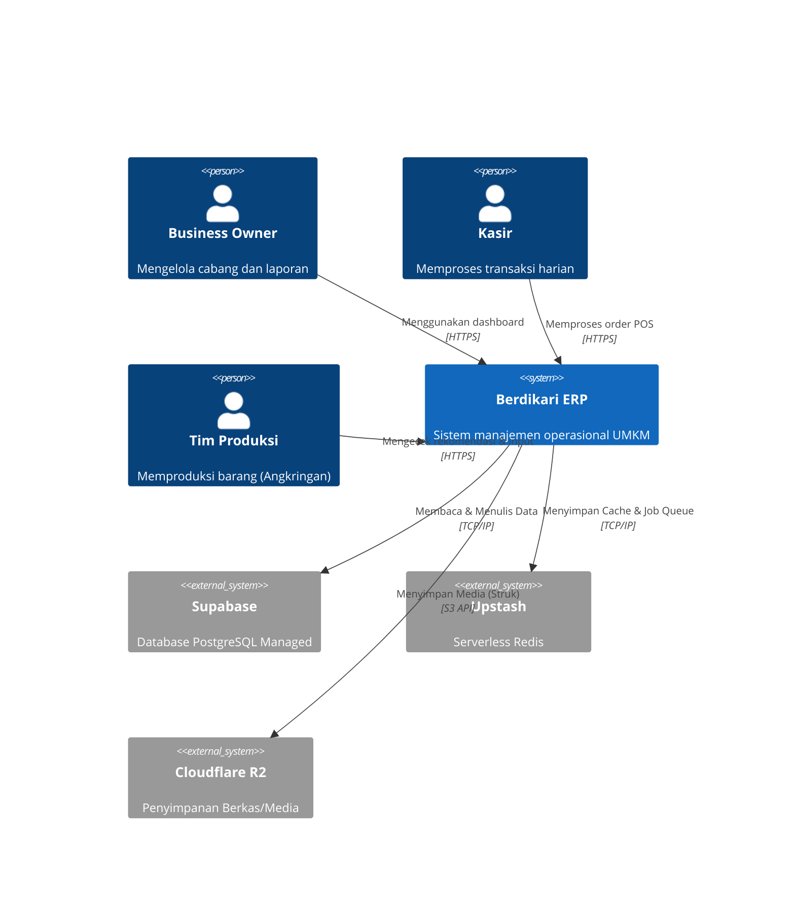
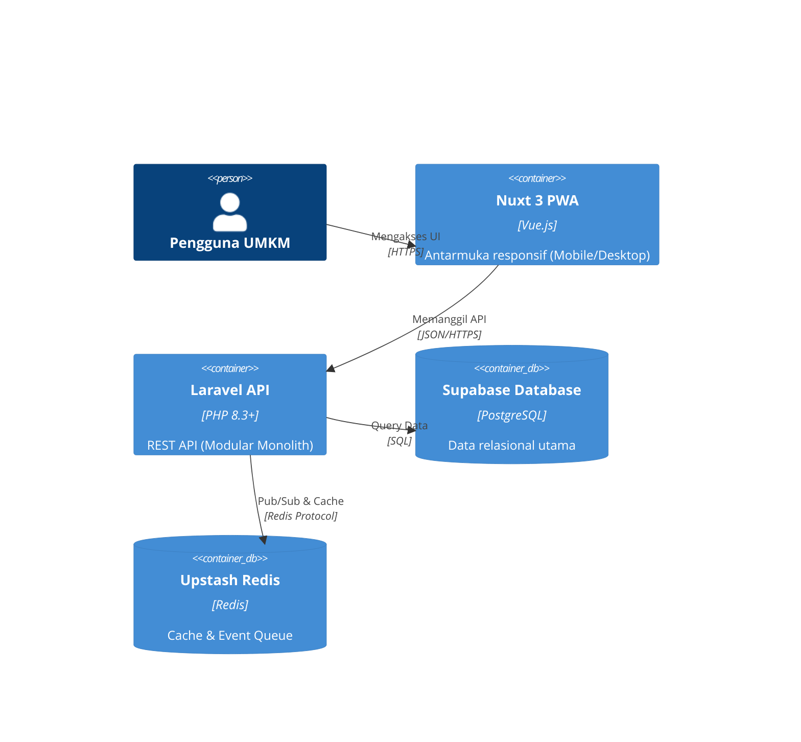

# C4 Diagrams

## 1. Context Diagram (Level 1)

```mermaid
C4Context
    Person(admin, "Business Owner", "Mengelola cabang dan laporan")
    Person(cashier, "Kasir", "Memproses transaksi harian")
    Person(production, "Tim Produksi", "Memproduksi barang (Angkringan)")
    
    System(erp, "Berdikari ERP", "Sistem manajemen operasional UMKM")
    
    System_Ext(supabase, "Supabase", "Database PostgreSQL Managed")
    System_Ext(upstash, "Upstash", "Serverless Redis")
    System_Ext(r2, "Cloudflare R2", "Penyimpanan Berkas/Media")
    
    Rel(admin, erp, "Menggunakan dashboard", "HTTPS")
    Rel(cashier, erp, "Memproses order POS", "HTTPS")
    Rel(production, erp, "Mengecek rekomendasi & input", "HTTPS")
    
    Rel(erp, supabase, "Membaca & Menulis Data", "TCP/IP")
    Rel(erp, upstash, "Menyimpan Cache & Job Queue", "TCP/IP")
    Rel(erp, r2, "Menyimpan Media (Struk)", "S3 API")
```

## 2. Container Diagram (Level 2)

```mermaid
C4Container
    Person(user, "Pengguna UMKM")
    
    Container(pwa, "Nuxt 3 PWA", "Vue.js", "Antarmuka responsif (Mobile/Desktop)")
    Container(api, "Laravel API", "PHP 8.3+", "REST API (Modular Monolith)")
    
    ContainerDb(db, "Supabase Database", "PostgreSQL", "Data relasional utama")
    ContainerDb(redis, "Upstash Redis", "Redis", "Cache & Event Queue")
    
    Rel(user, pwa, "Mengakses UI", "HTTPS")
    Rel(pwa, api, "Memanggil API", "JSON/HTTPS")
    Rel(api, db, "Query Data", "SQL")
    Rel(api, redis, "Pub/Sub & Cache", "Redis Protocol")
```
