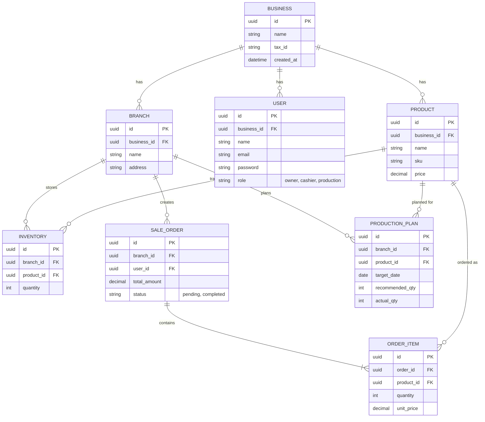

# Database Design (ERD)

Pendekatan Multi-Tenant: Kita menggunakan **Single Database, Shared Schema** dengan kolom `business_id` sebagai Diskriminator Tenant untuk mempermudah pemeliharaan dan menekan biaya infrastruktur. Keamanan data lintas penyewa (cross-tenant) dijamin melalui implementasi Laravel Global Scope.

