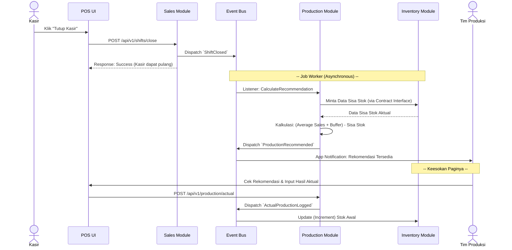

# Sequence Diagrams

## Alur Khusus: Tutup Kasir & Rekomendasi Produksi (Angkringan)

Ini menggambarkan implementasi arsitektur Event-Driven di poin penting peralihan hari bagi UMKM.

```mermaid
sequenceDiagram
    actor Kasir
    participant POS UI
    participant Sales Module
    participant Event Bus
    participant Production Module
    participant Inventory Module
    actor Tim Produksi

    Kasir->>POS UI: Klik "Tutup Kasir"
    POS UI->>Sales Module: POST /api/v1/shifts/close
    Sales Module->>Event Bus: Dispatch `ShiftClosed`
    Sales Module-->>POS UI: Response: Success (Kasir dapat pulang)
    
    Note over Event Bus, Inventory Module: -- Job Worker (Asynchronous) --
    Event Bus->>Production Module: Listener: CalculateRecommendation
    Production Module->>Inventory Module: Minta Data Sisa Stok (via Contract Interface)
    Inventory Module-->>Production Module: Data Sisa Stok Aktual
    Production Module->>Production Module: Kalkulasi: (Average Sales + Buffer) - Sisa Stok
    Production Module->>Event Bus: Dispatch `ProductionRecommended`
    Event Bus->>Tim Produksi: App Notification: Rekomendasi Tersedia
    
    Note over Tim Produksi, Inventory Module: -- Keesokan Paginya --
    
    Tim Produksi->>POS UI: Cek Rekomendasi & Input Hasil Aktual
    POS UI->>Production Module: POST /api/v1/production/actual
    Production Module->>Event Bus: Dispatch `ActualProductionLogged`
    Event Bus->>Inventory Module: Update (Increment) Stok Awal
```
